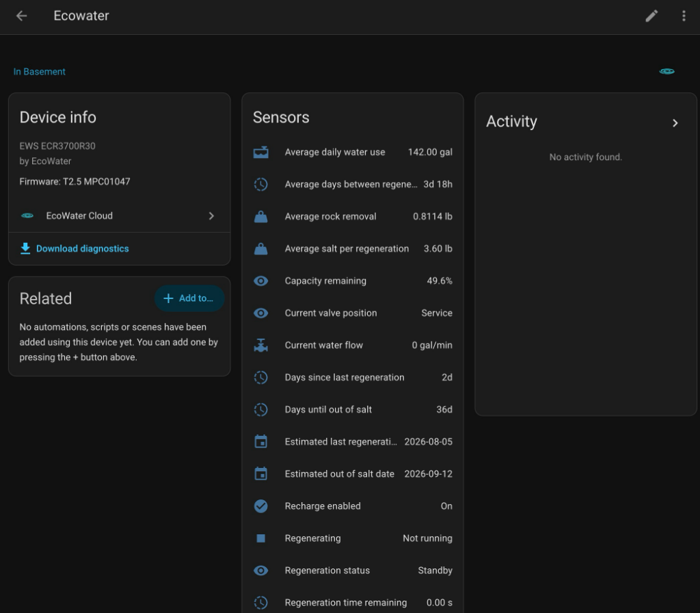

<p align="center">
  
</p>

<h1 align="center">EcoWater Cloud for Home Assistant</h1>

<p align="center">
  A modern, async Home Assistant integration for EcoWater cloud-connected water treatment devices.
</p>

<p align="center">
  <a href="https://github.com/andrewtryder/ha-ecowater-cloud/releases"></a>
  
  <a href="https://github.com/andrewtryder/ha-ecowater-cloud/blob/main/LICENSE"></a>
</p>

<p align="center">
  
</p>

---

## What It Does

This integration connects your EcoWater Wi-Fi-enabled water softener to Home Assistant via the EcoWater cloud, giving you Cloud-reported visibility into your EcoWater system without leaving your dashboard.

**Sensors include:**

| Category | Entities |
|---|---|
| **Water Usage** | Total used, daily average, treated water available, current flow rate |
| **Salt & Rock** | Salt level %, days until out of salt, estimated empty date, salt type, rock removed |
| **Regeneration** | Status (Standby / Regenerating / Scheduled), days since last, estimated last date |
| **Diagnostics** | Device online status, Wi-Fi signal strength, last cloud sync timestamp |

Entities are created dynamically — only capabilities your specific device reports will appear.

## Device Compatibility

| Backend | Region | OEM model | Display model | Status |
|---|---|---|---|---|
| Ayla | US | EWS3500 | EWS ECR3700R30 | Live tested |
| Ayla | EU | — | — | Endpoint implemented, untested |
| HydroLink | — | — | — | Not supported |

Other Ayla-connected EcoWater devices reporting an EWS* OEM model may work, but only EWS3500/ECR3700R30 has been live tested.

**Have a different model?** We'd love your help — see [Submitting a Device Fixture](#submitting-a-device-fixture) below.

> **HydroLink devices** are not supported here. If your softener uses HydroLink Home, check out [ha-ecowater-hydrolink](https://github.com/Roeli1996/ha-ecowater-hydrolink) instead.

## Important Notes

> **⚠️** Do **not** run the old `ecowater_softener` integration and this `ecowater_cloud` integration on the same account at the same time. Doing so can cause aggressive polling that may lead to account lockouts or temporary IP bans from the cloud service.

- This integration is **read-only** — no control actions (e.g. triggering a regeneration) are implemented.
- Diagnostic entities ending with `(raw)` (e.g., `hardness_setting_raw`, `motor_state_raw`) represent uninterpreted protocol values directly reported by the EcoWater cloud backend without unit conversions or assumed scaling.
- If you are migrating from the old integration, entities will **not** transfer automatically. This integration uses a separate domain (`ecowater_cloud`) and creates fresh entities.

## Installation

### Method 1: HACS (Custom Repository) — Recommended

1. Open **HACS** in Home Assistant.
2. Click the three dots in the upper right corner → **Custom repositories**.
3. Repository: `https://github.com/andrewtryder/ha-ecowater-cloud`
4. Category: **Integration**
5. Click **Add**.
6. Find **EcoWater Cloud** in HACS and click **Download**.
7. Restart Home Assistant.

### Method 2: Manual Installation

1. Download the latest release zip from [Releases](https://github.com/andrewtryder/ha-ecowater-cloud/releases).
2. Extract the `custom_components/ecowater_cloud` directory into your Home Assistant `<config>/custom_components/` directory.
3. Restart Home Assistant.

---

## Configuration

1. Go to **Settings → Devices & Services → Add Integration**.
2. Search for **EcoWater Cloud**.
3. Enter your **EcoWater Cloud credentials**:
   - **Email** / Username
   - **Password**
4. Click **Submit**.

---

## Companion Automation Blueprints

Easily import pre-built automation blueprints into Home Assistant to stay alerted on salt levels, flow, telemetry freshness, and regeneration status.

| Blueprint | Description | Import |
|---|---|---|
| **Low Salt Notification** | Alert when salt level drops below a target percentage or low-salt alert triggers | [](https://my.home-assistant.io/redirect/blueprint_import/?blueprint_url=https%3A%2F%2Fgithub.com%2Fandrewtryder%2Fha-ecowater-cloud%2Fblob%2Fmain%2Fblueprints%2Fautomation%2Fecowater_cloud%2Flow_salt_notification.yaml) |
| **High Water Flow Alert** | Warn if continuous water flow exceeds a threshold (e.g. 5 GPM) for N minutes | [](https://my.home-assistant.io/redirect/blueprint_import/?blueprint_url=https%3A%2F%2Fgithub.com%2Fandrewtryder%2Fha-ecowater-cloud%2Fblob%2Fmain%2Fblueprints%2Fautomation%2Fecowater_cloud%2Fhigh_flow_alert.yaml) |
| **Stale Data Warning** | Alert when EcoWater cloud telemetry has not synced for over 24 hours | [](https://my.home-assistant.io/redirect/blueprint_import/?blueprint_url=https%3A%2F%2Fgithub.com%2Fandrewtryder%2Fha-ecowater-cloud%2Fblob%2Fmain%2Fblueprints%2Fautomation%2Fecowater_cloud%2Fstale_data_notification.yaml) |
| **Regeneration Notification** | Notify when a regeneration cycle starts or completes | [](https://my.home-assistant.io/redirect/blueprint_import/?blueprint_url=https%3A%2F%2Fgithub.com%2Fandrewtryder%2Fha-ecowater-cloud%2Fblob%2Fmain%2Fblueprints%2Fautomation%2Fecowater_cloud%2Fregeneration_notification.yaml) |

## Maintenance Dashboard Helper

Add a concise, formatted device-health view to your Lovelace dashboard by copying the YAML snippet below into an **Entities** card. Replace the example entity IDs below with the corresponding entities from your EcoWater device:

```yaml
type: entities
title: EcoWater Device Health
entities:
  - entity: binary_sensor.ecowater_softener_system_problem
    name: System Status
  - entity: binary_sensor.ecowater_softener_data_stale
    name: Cloud Telemetry Freshness
  - entity: sensor.ecowater_softener_salt_level
    name: Salt Level
  - entity: sensor.ecowater_softener_days_until_out_of_salt
    name: Days Until Empty
  - entity: sensor.ecowater_softener_monthly_salt_use_estimate
    name: Monthly Salt Use Estimate
  - entity: sensor.ecowater_softener_regeneration_status
    name: Regeneration Status
  - entity: sensor.ecowater_softener_days_since_last_regeneration
    name: Days Since Last Regen
  - entity: binary_sensor.ecowater_softener_low_salt_alert
    name: Low Salt Alert
  - entity: binary_sensor.ecowater_softener_service_reminder_alert
    name: Service Reminder Alert
  - entity: sensor.ecowater_softener_wifi_signal_strength
    name: Wi-Fi Signal
```

## Troubleshooting

1. **Device not responding?** Open the official EcoWater app and confirm the device shows as online.
2. **Stale data?** Check the `source_last_updated` diagnostic sensor — it tells you the last time the device actually synced with the cloud.
3. **Need help?** Download the integration diagnostics file: **Settings → Devices & Services → EcoWater Cloud → Download diagnostics**, and attach it to a [GitHub Issue](https://github.com/andrewtryder/ha-ecowater-cloud/issues).

## Submitting a Device Fixture

If your device model isn't fully supported — or entities are missing — you can generate a **sanitized API fixture** to help us add support.

1. Clone this repository to a machine with Python installed.
2. Run the probe script:
   ```bash
   ECOWATER_USERNAME="your-email@example.com" \
   ECOWATER_PASSWORD="yourpassword" \
   python3 scripts/probe_ayla.py --write-fixture my_device.json
   ```
3. The script automatically redacts emails, IPs, MACs, tokens, and dealer info.
4. **Review the output file** to verify no personal data remains.
5. Attach the JSON to a [GitHub Issue](https://github.com/andrewtryder/ha-ecowater-cloud/issues).

> **Never post your credentials or raw API responses in public issues.**

## Privacy & Security

- Communicates exclusively with the EcoWater Ayla cloud servers over HTTPS.
- Credentials are stored and managed by Home Assistant.
- No telemetry or personal data is sent to the integration developer.

## Contributing

Contributions, bug reports, and device fixtures are welcome! See [CONTRIBUTING.md](CONTRIBUTING.md) for guidelines.

For architecture details, protocol notes, and development setup, see the [Development Guide](DEVELOPMENT.md).

## License

This project is licensed under the MIT License — see [LICENSE](LICENSE) for details.
